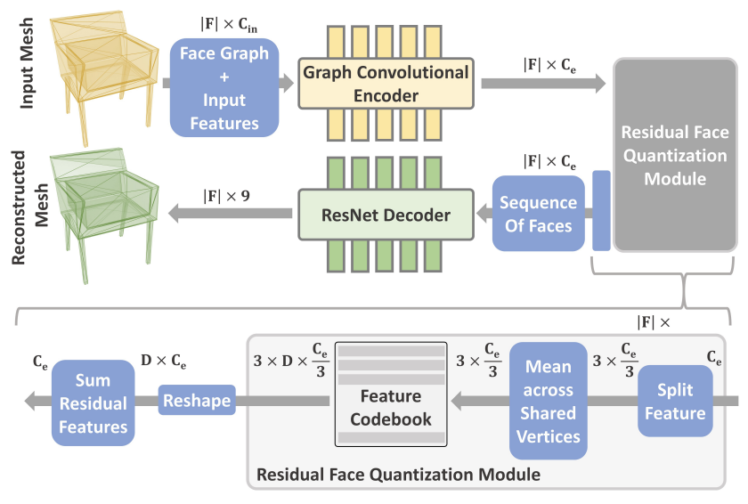
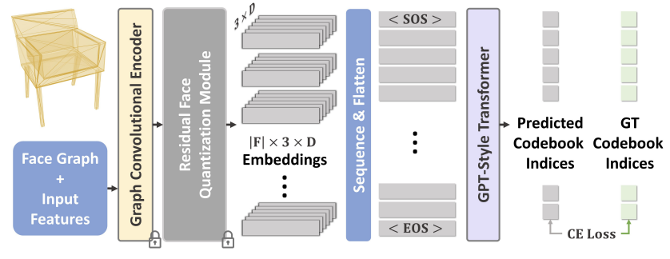

# MeshGPT
Pytorch Implementation of [MeshGPT: Generating Triangle Meshes with Decoder-Only Transformers]("https://arxiv.org/abs/2311.15475")

# Dependencies
Requirements:
- Python 3.10, CUDA 11.4
- V100

# Data Preparation
```
wget http://shapenet.cs.stanford.edu/shapenet/obj-zip/ShapeNetCore.v2.zip
```

# Usage
```
```

# Details
- Dataset
    - [ShapeNetV2](http://shapenet.cs.stanford.edu/shapenet/obj-zip/ShapeNetCore.v2.zip), 55 categories.
    - Trained on all 55 categories, finetuned on `Chair`, `Table`, `Bench`, `Lamp`
    - Preprocess
        - Planar Decimation (Blender)
            - angle tolerance $\alpha \in [1,60]$
            - Hansdorff distance closest and below $\delta_{hansdorff}$
        - Filter
            - face num $\leq$ 800
            - resulting in 28980 in data size
        - Train Test Split
            - `Chair`, `Table`, `Bench`, `Lamp` 9:1
        - Normalization
            - centered at origin
            - longest side = 1
        - Augmentation
            - Scaling [0.75, 1.25] at each axis, keep longest side = 1
            - Jitter shift [-0.1, 0.1]
            - Planar Decimation (PolyGen), varying levels, keep below $\delta_{hansdorff}$

- Training

    </img>

    </img>

- Model
    - Codebook
        - Sequence ordering (PolyGen)
        - Face feature $f_i$
            - face = $\{(x_1,y_1,z_1),(x_2,y_2,z_2),(x_3,y_3,z_3)\}$
            - 9 coordinates (positonal embedded)
            - area
            - angles between its edges
            - face normal
        - Mesh $\mathcal{M} = (f_1,f_2,...,f_N)$
        - Encoder E (a stack of SAGEConv Encoders)
            - $Z = E(\mathcal{}M)$
        - Quantization (RQ)
            - D codes per face, each vertex D/3 code, 3 vertex
            - mean pooling vertex, concatenate face
            - $T = RQ(Z)$
        - Decoder G (1D ResNet34)
            - $\mathcal{M} = G(Z)$
            - classification 
    - GPT

# LikeWise Papers

- PolyGen [Paper](https://arxiv.org/pdf/2002.10880.pdf) [Code](https://github.com/google-deepmind/deepmind-research/tree/master/polygen)
- AtlasNet [Paper]() [Code]()
- BSPNet [Paper]() [Code]()
- Get3D [Paper]() [Code]()